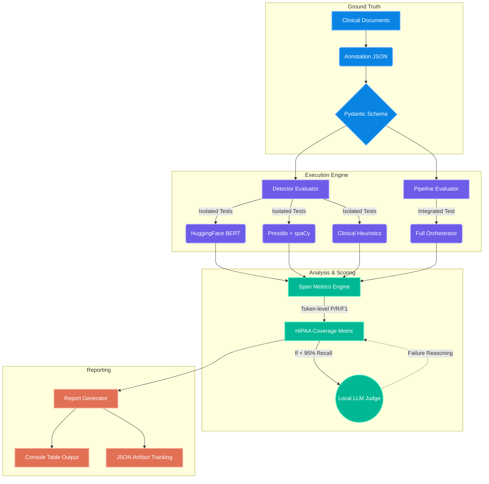

# HIPAA De-identification Evaluation Framework

The HIPAA De-identification Evaluation Framework is a robust, data-driven testing harness designed to ensure the integrity of clinical data privacy. It acts as an automated audit layer, systematically measuring the performance of the Protected Health Information (PHI) detection models against the strict regulatory requirements of the HIPAA Safe Harbor standard. 

## What is Being Evaluated

This framework specifically targets the **detection phase** of the de-identification pipeline. Before any text transformation or redaction occurs, the system must accurately identify and categorize up to 18 specific types of PHI (e.g., Patient Names, Medical Record Numbers, Dates, and Social Security Numbers) hidden within complex, unstructured clinical narratives. We evaluate the system's ability to navigate ambiguous context, OCR errors, and domain-specific medical jargon to ensure that no sensitive data slips through the cracks due to model blind spots or heuristic failures.

## How the Evaluation Works

The evaluation relies on high-fidelity, manually annotated ground-truth datasets that represent real-world clinical documentation. Rather than relying solely on synthetic data, the framework tests the models against actual edge cases found in healthcare settings. 

The engine operates in two primary modes:
1. **Isolated Analysis:** It evaluates individual detection components (HuggingFace BERT models, Presidio with spaCy, and custom clinical heuristics) in complete isolation. This exposes the specific strengths and weaknesses of each underlying technology.
2. **Pipeline Integration Analysis:** It evaluates the fully orchestrated pipeline, assessing how well the system's overlap resolution logic merges the outputs from the individual detectors to create the final redaction map.

The system is built on top of the `deepeval` framework, allowing us to enforce strict programmatic compliance thresholds, and gracefully incorporates a local LLM Judge for intelligent, automated failure analysis.

## Core Metrics & Compliance

To provide a precise and unforgiving reflection of performance, the framework computes deterministic, token-level matching metrics rather than relying on fuzzy span overlaps:

* **Precision:** When the model flags a span of text as PHI, how often is it actually PHI? High precision minimizes false positives and prevents the over-redaction of clinically relevant medical terms.
* **Recall (The Critical Metric):** How much of the actual, ground-truth PHI in the document did the model successfully find? High recall minimizes false negatives and directly prevents HIPAA violations.
* **F1 Score:** The harmonic mean of precision and recall, providing a balanced view of overall model accuracy.
* **HIPAA Coverage Score:** A strict, custom compliance metric enforcing a minimum **95% Recall threshold** specifically on "Critical" entity types (Names, Dates, MRNs, SSNs, etc.). A score below 95% triggers an immediate pipeline failure and initiates the diagnostic process.

## Framework Architecture



### Architectural Flow

The architecture is designed for modularity, strict validation, and deterministic scoring. 

It begins with the **Ground Truth** layer, which parses manually annotated JSON files through strict Pydantic schemas to ensure absolute data integrity. The **Execution Engine** then feeds this validated data into specialized runners. The `DetectorEvaluator` isolates individual models to expose specific technological blind spots, while the `PipelineEvaluator` tests the final, merged output of the orchestrator. 

The core of the system lies in the **Analysis & Scoring** layer. The `Span Metrics Engine` calculates exact token-level overlaps, generating the raw statistics. These statistics feed into the `HIPAA Coverage Metric`, a custom `deepeval` wrapper that enforces the mandatory 95% compliance threshold. If a detector fails to meet this threshold, the framework seamlessly triggers the **Local LLM Judge** (utilizing a locally hosted reasoning model, such as DeepSeek R1) to perform a qualitative analysis, explaining *why* the critical entities were missed or misclassified. 

Finally, the **Reporting** layer aggregates these quantitative metrics and qualitative findings into rich console tables and historical JSON artifacts for long-term tracking.

## Usage & Examples

The framework provides a clean command-line interface for triggering evaluations locally or integrating them into automated CI/CD pipelines.

### Running Evaluations

```powershell
# Evaluate the full pipeline against a test document (Standard run)
python -m hipaa_deidentifier.phi_detection.evaluation \
    --document "data/Long-term and Supportive Care/home_health_assessment_patient_01.txt"

# Run specific detectors without the LLM judge (Fast diagnostic run)
python -m hipaa_deidentifier.phi_detection.evaluation \
    --document "data/Outpatient Documentation/consultation_note_patient_01.txt" \
    --detectors hf,presidio \
    --no-judge

# Export results to a specific JSON directory for tracking
python -m hipaa_deidentifier.phi_detection.evaluation \
    --document "data/Outpatient Documentation/consultation_note_patient_01.txt" \
    --output-json ./metrics/history/
```

### Example Console Output

The generator produces an easy-to-read, comprehensive breakdown of the results across all tested components:

```text
================================================================================
  PHI DETECTION EVALUATION REPORT
  Document : home_health_assessment_patient_01
  Timestamp: 2026-05-02 10:00 UTC
  Standard : HIPAA Safe Harbor (45 CFR section 164.514(b))
================================================================================

[METRICS] Per-Detector x Per-Entity-Type Metrics (Token-Level Primary)

| Detector                       | Entity Type          |   Precision |   Recall |     F1 |    FNR |    FPR | Token-Recall   | Span-Recall   |
|:-------------------------------|:---------------------|------------:|---------:|-------:|-------:|-------:|:---------------|:--------------|
| HF (obi/deid_bert_i2b2)        | ALL (overall)        |       0.296 |    0.160 |  0.207 |  0.840 |  0.020 | 0.160          | 0.000         |
|                                |   NAME               |       0.195 |    0.150 |  0.169 |  0.850 |  0.012 | 0.150          | 0.000         |
|                                |   MRN                |       0.000 |    0.000 |  0.000 |  1.000 |  0.001 | 0.000          | 0.000         |
|--------------------------------|----------------------|-------------|----------|--------|--------|--------|----------------|---------------|
| Presidio + spaCy               | ALL (overall)        |       0.338 |    0.348 |  0.343 |  0.652 |  0.034 | 0.348          | 0.316         |
|                                |   NAME               |       0.218 |    0.290 |  0.249 |  0.710 |  0.020 | 0.290          | 0.286         |
|--------------------------------|----------------------|-------------|----------|--------|--------|--------|----------------|---------------|

[SUMMARY] Overall Summary (All Entity Types)

| Detector                |   Overall Precision |   Overall Recall |   Overall F1 |   FNR |   HIPAA Coverage | PASS/FAIL   |
|:------------------------|--------------------:|-----------------:|-------------:|------:|-----------------:|:------------|
| HF (obi/deid_bert_i2b2) |               0.296 |            0.160 |        0.207 | 0.840 |            0.142 | [FAIL]      |
| Presidio + spaCy        |               0.338 |            0.348 |        0.343 | 0.652 |            0.350 | [FAIL]      |
| Heuristics              |               0.671 |            0.174 |        0.276 | 0.826 |            0.154 | [FAIL]      |
| Full Pipeline           |               0.337 |            0.365 |        0.350 | 0.635 |            0.358 | [FAIL]      |

[ANALYSIS] HIPAA Coverage Analysis & LM Studio Judge Verdicts

--------------------------------------------------------------------------------

[FAIL] HF (obi/deid_bert_i2b2)
   Critical Entity Recall: 14.2%
   FAIL - Critical entity recall: 14.2% (threshold: 95%). Missed: 10 critical PHI entities.

[FAIL] Presidio + spaCy
   Critical Entity Recall: 35.0%
   FAIL - Critical entity recall: 35.0% (threshold: 95%). Missed: 9 critical PHI entities.
```
